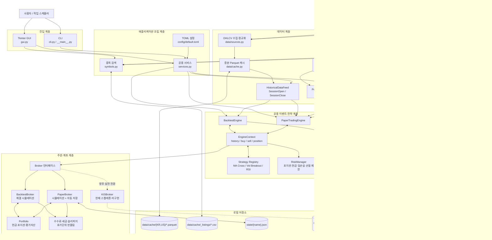
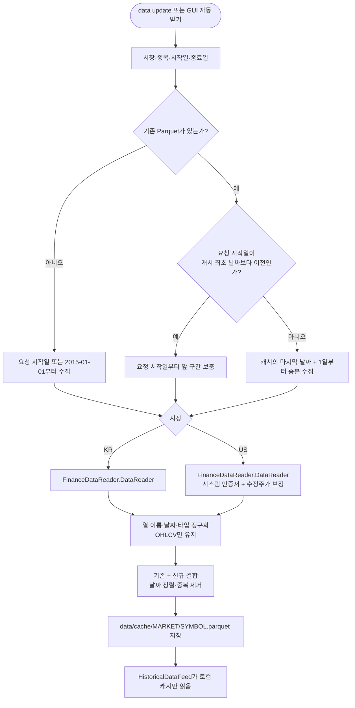
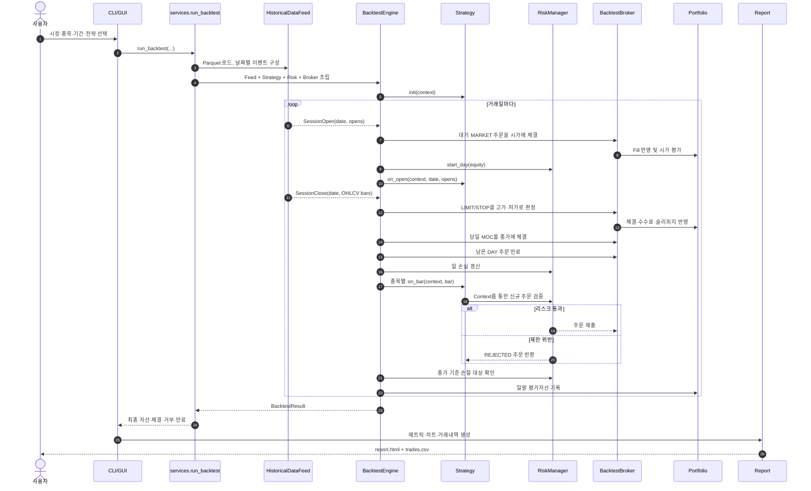
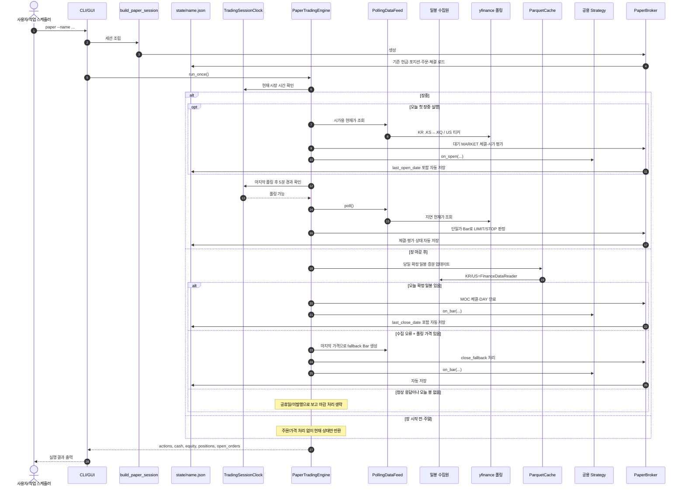
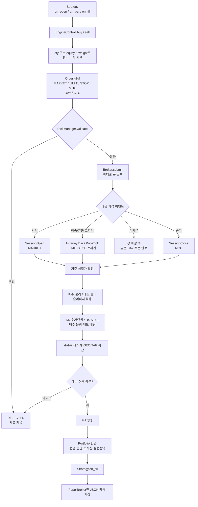

# 트레이딩 봇 전체 아키텍처

이 문서는 현재 구현을 기준으로 데이터 수집, 백테스트, 모의투자, 주문·체결,
상태 저장 흐름을 설명한다. 핵심 설계는 **동일한 전략 코드와 주문 인터페이스를
백테스트와 모의투자에서 함께 사용**하는 이벤트 기반 구조다.

## 1. 전체 시스템 구성



현재 실행 경로에서 `KISBroker`는 사용되지 않는다. 모든 메서드가
`NotImplementedError`이며, KIS 인증·주문·체결 조회·잔고 동기화를 구현한 뒤에만
실전 경로로 교체할 수 있다.

## 2. 데이터 수집과 캐시 갱신



종목 검색용 목록은 가격 데이터와 별도다. 국내는 KRX 주식과 `ETF/KR`을
FinanceDataReader로 받는다. 미국은 NASDAQ Trader 공식 심볼 디렉터리에서 미국
거래소 상장 주식과 ETF를 받는다. 결과는 `data/cache/_listings/{KR,US}.csv`에
7일 동안 캐시한다. 목록에 없는 종목은 GUI에서 코드를 직접 추가할 수 있으며,
검색 소스 구성이 바뀌면 캐시 버전을 비교해 기간 전에도 목록을 자동 갱신한다.

## 3. 백테스트 동작 순서

백테스트 중에는 네트워크를 사용하지 않고 Parquet 캐시만 읽는다.



종가(`on_bar`)에서 생성한 일반 `MARKET` 주문은 다음 `SessionOpen`에서 체결된다.
이 순서로 당일 종가 신호를 당일 가격에 체결하는 룩어헤드를 피한다.

## 4. 모의투자 1회 실행 동작

권장 운영 방식은 작업 스케줄러가 5분마다 `paper` 명령을 **한 번씩** 실행하는
형태다. 각 호출은 JSON 상태를 다시 읽으므로 프로세스가 종료되어도 계좌 상태가
이어진다.



장 마감 확정 일봉의 수집 과정은 2번 다이어그램과 동일하다.

## 5. 전략 주문부터 체결까지



리스크 검사는 매수 주문에 대해 다음을 적용한다.

- 일 손실 한도 도달 시 신규 진입 차단
- 최대 보유 종목 수
- 종목당 최대 평가 비중
- 최소 현금 버퍼
- 장 마감 후 평단 대비 손절 기준 충족 시 매도 주문 생성

매도 주문은 포지션 청산을 막지 않도록 신규 진입 제한 검사를 통과시킨다.

## 6. 실행 모드 비교

| 구분 | 백테스트 | 모의투자 | KIS 실전/모의 API |
|---|---|---|---|
| 엔진 | `BacktestEngine` | `PaperTradingEngine` | 미연결 |
| 가격 | 로컬 확정 일봉 | yfinance 폴링 + 확정 일봉 | 향후 KIS 시세/체결 조회 |
| 브로커 | `BacktestBroker` | `PaperBroker` | `KISBroker` 스켈레톤 |
| 체결 | OHLCV 규칙으로 시뮬레이션 | 폴링 가격으로 시뮬레이션 | 거래소/증권사 실제 체결 |
| 상태 | 실행 중 메모리 | `state/{name}.json` 영속화 | 구현 필요 |
| 결과 | HTML·CSV 리포트 | 콘솔/GUI 상태 및 JSON | 구현 필요 |
| 네트워크 | 실행 시 사용 안 함 | 장중·마감 데이터 조회 시 사용 | 필수 |

## 7. 주요 코드 위치

| 역할 | 파일 |
|---|---|
| CLI / GUI 진입점 | `src/tradingbot/cli.py`, `src/tradingbot/gui.py` |
| 객체 조립과 공용 서비스 | `src/tradingbot/services.py` |
| 외부 OHLCV 수집 / Parquet | `src/tradingbot/data/sources.py`, `data/cache.py` |
| 과거 이벤트 / 장중 폴링 | `src/tradingbot/data/feed.py`, `data/polling.py` |
| 백테스트 / 모의 엔진 | `src/tradingbot/engine/engine.py`, `engine/paper.py` |
| 세션 시간 | `src/tradingbot/engine/clock.py` |
| 거래소 캘린더 (휴장일·조기폐장) | `src/tradingbot/engine/calendar.py` |
| 전략 공통 인터페이스 | `src/tradingbot/strategies/base.py` |
| 전략 상태 영속화 | `src/tradingbot/strategies/state.py` |
| signal_id 멱등성 원장 | `src/tradingbot/strategies/signals.py` |
| Point-in-Time 가격 조회 | `src/tradingbot/data/store.py` |
| 연구·검증 (IC/분위수/Walk-forward) | `src/tradingbot/research/` |
| 가치평가·의사결정 코어 (DCF/IRR/역산/신호) | `src/tradingbot/valuation/` |
| 횡단면 팩터 (모멘텀 등) | `src/tradingbot/factors/` |
| 주문·체결 시뮬레이션 | `src/tradingbot/broker/backtest.py` |
| 모의 계좌 영속화 | `src/tradingbot/broker/paper.py` |
| 향후 KIS 연동 슬롯 | `src/tradingbot/broker/kis.py` |
| 포트폴리오 / 리스크 | `src/tradingbot/portfolio.py`, `src/tradingbot/risk.py` |
| 메트릭 / HTML 리포트 | `src/tradingbot/report/metrics.py`, `report/report.py` |

## 8. VS Code에서 보는 방법

현재 설치된 VS Code 1.128에서는 Mermaid가 기본 기능으로 포함되어 있으므로
확장팩이 필요 없다.

1. 이 파일(`docs/architecture.md`)을 연다.
2. `Ctrl+Shift+V`를 눌러 미리보기를 열거나 `Ctrl+K`, `V`를 순서대로 눌러
   오른쪽에 미리보기를 연다.
3. 큰 다이어그램은 미리보기 위에서 확대·축소하고 이동할 수 있다.

VS Code 1.120 이하를 사용한다면 업데이트를 권장한다. 별도 편집·PNG/SVG 내보내기,
문법 오류 표시가 필요할 때만 공식 **Mermaid Chart** 확장
(`MermaidChart.vscode-mermaid-chart`)을 선택적으로 설치한다.

```powershell
code --install-extension MermaidChart.vscode-mermaid-chart
```

Mermaid 렌더러 확장을 여러 개 동시에 활성화하면 미리보기에서 충돌할 수 있으므로
하나만 사용한다. 과거의 `bierner.markdown-mermaid` 확장은 VS Code 1.121에
기본 기능으로 통합되어 현재는 deprecated 상태다.

## 9. 현재 구현상 주의점

- 모의투자 폴링 가격은 지연될 수 있어 실시간 체결 재현이 아니다.
- 일봉 기반 백테스트는 봉 내부의 실제 가격 경로와 부분 체결·호가 깊이를 모른다.
- 세션 클록은 `exchange_calendars`(XKRX/XNYS) 기반 거래소 캘린더를 사용해
  공휴일·조기폐장·지연개장(예: KRX 신년 첫 거래일 10시 개장)을 반영한다.
  캘린더 데이터 범위를 벗어난 날짜는 평일 규칙으로 폴백하고 경고를 남긴다.
- 전략 내부 상태(예: `rsi_reversion`의 보유일 카운터)는 모의투자에서
  `state/{이름}.strategy.json`에 저장되어 프로세스 재시작 후 복구된다.
  상태 파일이 손상되면 조용히 초기화하지 않고 오류를 발생시킨다.
- 현재는 한 프로세스가 한 시장·한 통화를 담당하며 환율 변환이 없다.
- KIS 브로커는 실제 주문이 불가능한 미구현 슬롯이다.
