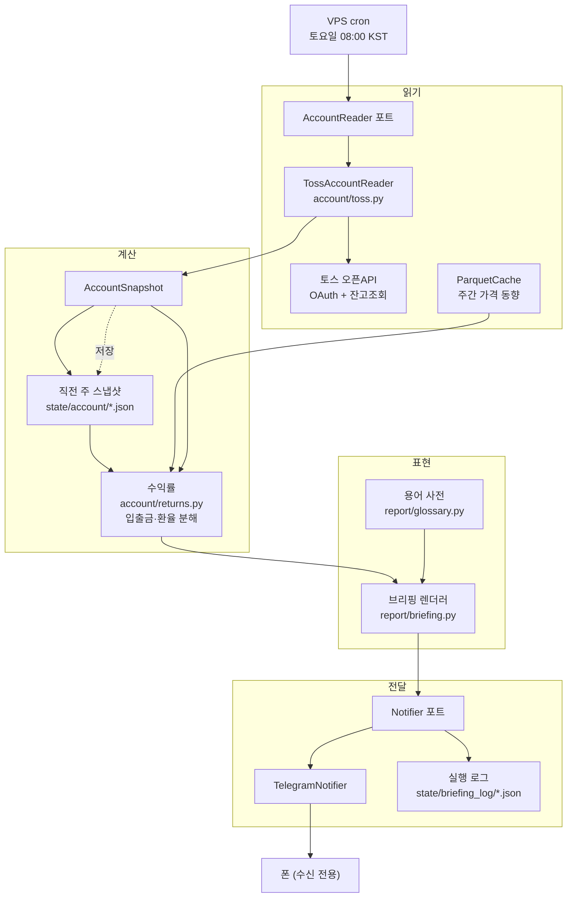

# 주간 브리핑 M1 설계 — 계좌 읽기·쉬운 워딩·모바일 전달

- 날짜: 2026-08-17
- 상태: 초안 — 사용자 승인 대기
- 검토 근거: [`docs/weekly_briefing_design_review.md`](../../weekly_briefing_design_review.md)
- 확정된 방향: **반자동** (제안 → 모바일 승인 → 집행). 이 문서는 그 종착지로 가는
  첫 단계만 설계한다.

## 1. 한 문단 요약

VPS가 매주 토요일 아침 한 번 깨어나 토스증권 계좌를 **읽고**, 이번 주에 무슨 일이
있었는지 주식 비전문가의 말로 정리해 텔레그램으로 보낸다. 주문은 하지 않고 매매
제안도 하지 않는다 — 그 둘은 M3의 몫이고, 검증을 통과한 전략이 생긴 뒤의 일이다.
M1이 만드는 것은 **읽기 전용 계좌 포트, 입출금·환율을 반영한 정직한 수익률, 용어를
한 곳에서 강제하는 장치, 단방향 알림 채널, 그리고 이 넷을 주 1회 굴리는 리눅스
실행 환경**이다. 주문 코드가 한 줄도 없으므로 **M1의 어떤 버그도 돈을 움직이지
못한다.**

## 2. 범위

### 만드는 것 (요구사항 1·3·5)

| 요구 | 산출물 |
|---|---|
| 1. 계좌 현황 read | `account/` — 읽기 전용 포트 + 토스 구현 + 수익률 계산 |
| 3. 쉬운 워딩 | `report/glossary.py` + 금칙어 테스트 |
| 5. 모바일 수신 | `notify/` 텔레그램 + VPS 주간 cron + 리눅스 실행 환경 |

### 만들지 않는 것

- **주문·집행 경로 일체.** `broker/`는 건드리지 않는다. 토스 자격증명은 M1에서
  조회에만 쓰인다.
- **매매 제안** (요구사항 4). M3. 근거는 검토 문서 §4.4 — 승격을 통과한 전략이
  없고, 주간 리밸런싱으로는 판정을 낸 적조차 없다.
- **뉴스** (요구사항 2). M2.
- GUI 변경. `gui.py`는 그대로 두고 M1은 CLI 경로만 쓴다.
- 백테스트·모의투자 경로 변경.

### 왜 이 순서인가

M1은 알고리즘의 품질과 무관하게 성립한다. 그리고 M1이 매주 쌓는 계좌 스냅샷이
**M3에서 제안을 실계좌로 검증할 때의 원천 데이터**가 된다. 먼저 돌려둘수록 M3이
빨라진다.

## 3. 전체 흐름



주문 경로가 이 그림에 없다는 것이 M1의 핵심 성질이다.

## 4. 컴포넌트 설계

### 4.1 `account/` — 읽기 전용 포트

`broker/base.py`의 `Broker`(주문·체결 11개 메서드)와 **별개의 포트**를 신설한다.
계좌를 읽기 위해 주문 인터페이스를 구현해야 하는 현재 구조가 M1을 막는 것이
검토의 결론이었다.

```python
# src/tradingbot/account/base.py

@dataclass(frozen=True)
class Holding:
    symbol: str          # KR은 6자리 코드, US는 티커 (symbols.py 관례와 동일)
    market: str          # "KR" | "US"
    qty: float           # 소수점 매수 대비 float
    avg_price: float     # 증권사가 준 매입단가. 우리가 계산하지 않는다.
    last_price: float
    currency: str        # "KRW" | "USD"

@dataclass(frozen=True)
class AccountSnapshot:
    as_of: datetime               # 증권사가 준 기준 시각
    holdings: tuple[Holding, ...]
    cash: dict[str, float]        # currency -> 예수금
    fx_to_krw: dict[str, float]   # currency -> 원화 환율

class AccountReader(Protocol):
    def snapshot(self) -> AccountSnapshot: ...
```

세 가지 설계 판단:

- **`Portfolio`를 재사용하지 않는다.** `portfolio.py:22`의 `apply_fill`은 체결을
  쌓아 평단을 스스로 만든다. 실계좌는 반대다 — 증권사가 준 수량·평단이 진실이고,
  우리가 계산하면 수수료·분할·배당재투자·앱에서 직접 한 매매 때문에 어긋난다.
- **`as_of`는 증권사가 준 시각**이지 우리 시계가 아니다. 응답이 캐시된 옛 데이터일
  때 조용히 넘어가지 않기 위해서다. 렌더러가 이 값이 6시간 이상 오래되면 브리핑에
  경고를 넣는다.
- **환율을 스냅샷 안에 박아 넣는다.** 나중에 다시 계산해도 같은 숫자가 나와야 한다.
  **해외주식 잔고 응답에 원화 평가액과 적용 환율이 온다(확인됨)**, 그러니 그 값을
  그대로 쓴다. `data/macro.py:32`의 `usdkrw`는 응답에 값이 빠졌을 때의 폴백으로만
  두고, 어느 쪽에서 왔는지 스냅샷에 기록한다 — 내가 계산한 환율과 증권사가 적용한
  환율이 다르면 앱 화면과 브리핑의 숫자가 어긋나기 때문이다.
- **수량은 토스가 준 표기를 그대로 보존한다.** `qty`는 계산용 float이지만, 스냅샷에
  원본 문자열을 함께 남기고 **화면에는 그 원본을 쓴다.** 소수점 보유에서 float
  반올림으로 앱과 다른 숫자를 보여주면, 그 순간 사용자는 브리핑 전체를 의심하게
  된다. 요구사항 3은 쉬운 말만이 아니라 **앱과 같은 숫자**를 요구한다.

#### 토스 구현 (`account/toss.py`)

- 자격증명은 `data/credentials.py`의 `require_env` 패턴을 그대로 쓴다 —
  `TOSS_CLIENT_ID`, `TOSS_CLIENT_SECRET`, `TOSS_ACCOUNT_NO`. hint에는 발급 위치
  (WTS 설정 > Open API)와 **허용 IP 등록**을 함께 적는다.
- **토큰 캐시는 선택이 아니라 필수다.** client 당 유효 토큰이 하나뿐이라 새로
  발급하면 이전 것이 즉시 무효화된다. `state/toss_token.json`에 만료시각과 함께
  저장하고, 만료 60초 전에만 재발급한다. 파일 권한 `0600`.
- **유효기간은 하드코딩하지 않는다.** 2차 자료가 1시간과 24시간으로 엇갈리지만
  그건 알 필요가 없다 — 토큰 응답의 `expires_in`을 그대로 신뢰하면 된다. 상수로
  박아두면 토스가 값을 바꿨을 때 조용히 401을 맞는다.
- **403은 특별 취급한다.** 미등록 IP 호출은 키가 맞아도 403이고, 이것이 이 구성에서
  가장 흔한 실패다. 403을 잡아 "허용 IP 목록에 현재 공인 IP가 있는지 확인하세요
  (`curl ifconfig.me`)"라는 문구로 바꿔 보고한다. 일반 인증 오류와 섞으면 원인을
  찾는 데 하루가 든다.

### 4.2 `account/returns.py` — 정직한 수익률

`report/metrics.py`는 **입출금이 없는 백테스트 전제**로 `equity/initial_cash - 1`을
쓴다. 실계좌에 그대로 쓰면 틀린다. M1은 별도 함수를 둔다.

**종목별 수익률.** 증권사가 준 평단 기준: `(last_price - avg_price) / avg_price`.
USD 종목은 여기에 환율 기여를 분리해 두 줄로 낸다.

```
원화 수익률 ≈ (1 + 주가 수익률) × (1 + 환율 변동) - 1
```

"주가는 올랐는데 원화로는 손해"를 설명하지 못하면 요구사항 3이 무너진다.

**전체 수익률.** 주간 스냅샷을 이어붙인 시간가중수익률(TWR)로 계산한다. 각 주의
수익률은 그 주의 입출금을 제외하고 재므로 "이번 주에 100만원 넣었더니 수익률이
올랐다" 같은 거짓말을 하지 않는다.

**입출금을 어떻게 아는가.** 토스 API에 입출금 내역 조회가 있으면 그대로 쓴다.
없다면 스냅샷 두 개만으로는 입금과 수익을 구분할 수 없다. **어느 쪽인지 몰라도
착수할 수 있다** — 아래 폴백이 두 경우를 모두 덮고, 실제 응답을 보면서 결정하면
된다.

> 설명되지 않는 평가액 변화가 임계치(기본 1%)를 넘으면 **그 주의 전체 수익률을
> 계산하지 않고 "측정 불가"로 표시**하고, 입출금이 있었는지 되묻는 문장을 브리핑에
> 넣는다.

이건 이 저장소가 이미 쓰는 규칙이다 — `research/evaluation.py:269`가 구간이 부족한
walk-forward 승률을 통과가 아니라 "측정 불가"로 남기는 것과 같은 원칙이다. **틀린
숫자보다 빈칸이 낫다.**

### 4.3 스냅샷 저장 — `state/account/`

`state/account/YYYY-Www.json` (예: `2026-W34.json`)에 스냅샷 원본을 그대로 남긴다.

- **PIT 패널(`data/panel.py`)에 넣지 않는다.** 패널에 들어가면 팩터 입력으로
  오해되어 백테스트에 샐 수 있다. 계좌 잔고는 연구 데이터가 아니다.
- 이 파일들이 TWR 체인의 원천이고, M3에서 제안을 실계좌 결과와 대조할 때의 기록이
  된다.

### 4.4 `report/glossary.py` — 워딩을 한 곳에서 강제

요구사항 3은 "이 세션에서 개발 후 보고, 알림 등에서도 유효"를 요구한다. 출력 경로가
늘 때마다 워딩이 각자 갈라지는 것을 막는 방법은 하나뿐이다 — **사전을 한 곳에 두고,
테스트로 강제한다.**

```python
@dataclass(frozen=True)
class Term:
    label: str        # 화면에 나가는 쉬운 이름
    one_line: str     # 한 줄 설명
    fmt: Callable[[float], str]

TERMS: dict[str, Term] = {
    "total_return":  Term("전체 수익률", "처음 넣은 돈 대비 지금 얼마나 늘었는지", pct),
    "max_drawdown":  Term("최대 하락폭", "가장 좋았던 때보다 얼마나 떨어졌었는지", pct),
    ...
}

BANNED = ("Sharpe", "샤프", "MDD", "drawdown", "exposure", "profit factor", ...)
```

**테스트가 이 설계의 핵심이다.** 사용자에게 나가는 문자열에 `BANNED` 항목이 그대로
등장하면 실패한다. "설명을 붙이면 허용" 같은 예외를 두는 순간 테스트가 무의미해지니,
M1은 전면 금지로 간다. 필요한 개념에는 새 이름을 준다.

`report/report.py:57`의 "Equity Curve"·"Drawdown"·"DD %"는 백테스트 리포트라 M1
범위 밖이지만, 사전이 생기면 나중에 같은 곳을 바라보게 만들 수 있다.

### 4.5 `report/briefing.py` — 브리핑 렌더러

입력은 이번 주 스냅샷 + 직전 주 스냅샷 + 가격 캐시. 출력은 텔레그램용 텍스트.

**섹션 목록으로 짠다.** M2의 뉴스와 M3의 제안이 섹션 하나씩 추가되는 형태로 붙어야
하기 때문이다.

```
① 한 줄 요약      "이번 주 전체 자산은 1.2% 늘었습니다."
② 이번 주 전체    평가액, 주간 변화, 누적 수익률(또는 측정 불가 사유), 현금 비중
③ 종목별          이름 · 보유 · 평단 · 현재가 · 수익률(USD 종목은 주가/환율 분해)
④ 주간 가격 동향  종목별 5거래일 변화
⑤ 알아둘 점       환율 영향, 레버리지 ETF 주석, 데이터 문제, 스냅샷 오래됨 경고
```

**레버리지 ETF 주석은 M1부터 넣는다.** SOXL·TECL을 보유 중이면 "3배 ETF는 하루
단위로 3배라서, 한 주 전체로는 기초지수의 정확히 3배가 아닙니다" 한 줄을 붙인다.
검토 문서 §4.2가 지적한 대로 이건 M2(뉴스)의 문제가 아니라 **워딩 설계의 문제**이고,
보유 중이라면 M1에서 이미 오해가 시작된다.

텔레그램 메시지 상한(4096자)을 넘으면 섹션 경계에서 나눈다.

### 4.6 `notify/` — 단방향 알림

```python
class Notifier(Protocol):
    def send(self, text: str) -> None: ...
```

`notify/telegram.py`가 Bot API `sendMessage`로 구현한다. `TELEGRAM_BOT_TOKEN`,
`TELEGRAM_CHAT_ID`를 환경변수로 받는다.

**M1의 Notifier는 단방향이다 — 그리고 이것이 M3의 가장 큰 난점을 예고한다.**
반자동의 승인 버튼은 봇이 사용자의 응답을 **받아야** 하는데, 주 1회 실행 프로세스는
사용자가 버튼을 누르는 시점에 살아 있지 않다. M3은 승인 대기 상태를 파일로 두고
(`state/pending_proposal.json`) 짧은 폴링이나 webhook 수신 프로세스를 따로 두어야
한다. M1에서 그것까지 만들지는 않지만, **Notifier 포트를 나중에 양방향으로 바꿔야
한다는 사실을 여기 적어 둔다.** M3 설계는 이 지점에서 시작한다.

전송 실패는 3회 재시도(2s/4s/8s) 후 로컬 로그에 남기고 **종료코드 1**로 끝낸다.
조용히 성공한 척하지 않는다.

### 4.7 CLI와 실행 시점

```
tradingbot briefing weekly [--dry-run] [--no-notify]
```

`cli.py`의 기존 서브파서 패턴(`set_defaults(handler=...)`)을 그대로 따른다.
`--dry-run`은 계좌를 읽고 렌더까지만 하고 전송하지 않는다 — VPS 셋업 검증용이다.

실행 로그는 `state/briefing_log/YYYYMMDDTHHMMSS.json`. `data/pipeline.py:250`의
`PipelineResult.to_dict()` 패턴을 그대로 재사용한다.

**실행 시점: 토요일 08:00 KST.** 금요일 저녁이 아닌 이유는 미국 금요일 장이 한국
시간 토요일 새벽(EDT 기준 05:00, EST 기준 06:00 KST)에 끝나기 때문이다. 금요일
저녁에 돌리면 미국 쪽 한 주가 아직 닫히지 않은 채로 "이번 주 수익률"을 계산하게
된다.

```cron
# VPS 타임존이 UTC일 때 (= 토 08:00 KST)
0 23 * * 5  cd /opt/trading-bot && .venv/bin/python -m tradingbot briefing weekly
```

M3의 매매 제안은 월요일 개장 전에 나와야 하므로 실행 시점이 다르다. 그래서 M1의
브리핑과 M3의 제안은 **처음부터 별개 서브커맨드**로 둔다.

## 5. 실행 환경 — 리눅스 VPS로 이전

검토 문서 §8.2 결론: 토스가 호출 IP를 허용 목록으로 검사하므로 **고정 공인 IP를
가진 상시 리눅스 호스트**로 좁혀진다. GitHub Actions는 러너 IP가 매번 바뀌어 쓸 수
없다.

"VPS"는 특정 상품이 아니라 **고정 IP + 상시 가동 + 내가 통제하는 리눅스 호스트**를
뜻한다. 집에 둔 라즈베리파이도 이 조건을 만족한다(단 ISP가 공인 IP를 바꾸면 403).

**여기서 "상시 가동"은 내 PC를 켜두라는 뜻이 아니다.** 자동매매를 배제했던 이유가
바로 그 전력 부담이었고, VPS는 남의 데이터센터에서 도는 서버라 내 전기가 0이다.
그리고 실제로 일하는 시간은 **주 1회 몇 분**이고 나머지는 토요일 아침에 스스로
깨어나기 위해 켜져 있을 뿐이라, 성능은 가장 싼 티어로 충분하다. 무언가를 내가
켜야 한다면 그 순간 요구사항 5("PC가 켜져있지 않아도")가 무너진다.

| 방식 | 내가 부담하는 것 | 월 비용 |
|---|---|---|
| VPS | 없음 | 5~7천원 (Oracle Always Free는 0원, 회수 리스크) |
| 라즈베리파이(집) | 전기 5~10W | 1~2천원 |
| 상시 가동 PC | 전기 60~100W + 소음·발열 | 1.5~2.2만원 |

### 5.1 에이전트 클라우드 샌드박스는 쓸 수 없다 (실측)

Claude Code 클라우드·Codex 클라우드 같은 에이전트 실행 환경에서 돌릴 수 있는지
실제로 재봤다. 이 저장소의 설계 세션이 그런 환경에서 돌고 있어서 그대로 측정이
가능했다.

```
openapi.tossinvest.com   도달 불가
api.tossinvest.com       도달 불가
corp.tossinvest.com      도달 불가
api.telegram.org         도달 불가
—— 대조군 ——
pypi.org                 200
api.github.com           200
```

**증권사 API도, 알림 채널도 나가지 못한다.** 이 환경들의 egress는 허용 목록
기반이고 거기에 증권사·메신저가 없다. 개발 도구용 통로만 열려 있다.

호스트가 뚫려 있더라도 남는 문제가 셋 더 있다.

1. **고정 공인 IP가 없다.** 토스 허용 목록에 등록할 주소가 없다.
2. **컨테이너가 휘발성이다.** 저장소를 매번 새로 클론하는 구조라 `data/cache/`와
   **`state/account/` 스냅샷이 사라진다.** 스냅샷은 TWR 체인의 유일한 원천이므로
   (§4.3) 이건 기능 저하가 아니라 데이터 소실이다.
3. **자격증명을 남의 실행 환경에 둔다.** 읽기 전용이 아니라면 주문 권한이 있는
   키다.

즉 이 경로는 정책이 바뀌어도 2·3 때문에 여전히 부적합하다. **개발과 설계는 이
환경에서 하고, 실행은 내가 통제하는 호스트에서 한다** — 둘을 나누는 것이 맞다.

작업 항목:

1. **`pyproject.toml:39`의 `[tool.uv] environments = ["sys_platform == 'win32'"]`.**
   락파일이 Windows 전용으로 풀려 있어 리눅스에서 `uv sync`가 되지 않는다. linux를
   추가해 재생성한다. **가장 구체적인 차단 지점이므로 M1의 첫 작업으로 둔다** —
   여기서 막히면 나머지가 의미 없다.
2. `truststore` 의존이 리눅스에서 동작하는지 확인한다(미국 가격 수집 경로).
   안 되면 `certifi` 폴백을 둔다.
3. `data/cache/`를 VPS 디스크에 영속화한다. 주 1회 증분 갱신이라 용량·대역폭은
   문제가 아니지만, 컨테이너를 새로 띄울 때마다 수 년치를 다시 받는 구성은 안 된다.
4. 토스 허용 IP에 VPS 공인 IP를 등록한다.

Windows 개발 환경은 그대로 둔다 — `.bat` 파일과 GUI는 계속 쓸 수 있어야 한다.

## 6. 보안

- **읽기 전용 스코프가 있으면 반드시 그것으로 발급한다**(§10-2). VPS가 침해돼도
  주문이 나가지 않는 것과 나가는 것의 차이는 크다.
- 자격증명은 환경변수로만 전달한다. 토큰 캐시 파일은 `0600`.
- `.env.template`에 `TOSS_*`, `TELEGRAM_*` 항목을 추가하되 값은 비운다.
- `.gitignore`에 `state/toss_token.json`이 이미 `state/` 규칙으로 덮이는지 확인한다.
- VPS 접속은 SSH 키 전용, 비밀번호 로그인 비활성.

## 7. 실패 모드

| 실패 | 감지 | 처리 |
|---|---|---|
| 허용 IP 불일치 | HTTP 403 | "허용 IP 확인" 전용 메시지, 종료코드 1 |
| 토큰이 다른 곳에서 무효화됨 | HTTP 401 | 1회 재발급 후 재시도, 실패 시 보고 |
| 토스 API 장애 | 5xx / 타임아웃 | 3회 지수 백오프. 실패해도 **직전 스냅샷 기준 브리핑을 보내고** 그 사실을 명시 |
| 텔레그램 전송 실패 | HTTP 오류 | 3회 재시도 → 로컬 로그 + 종료코드 1 |
| 가격 캐시가 오래됨 | 기존 staleness 가드 재사용 | 주간 동향 섹션에 "가격이 N일 오래됨" 표기 |
| 입출금 미상 | 설명 안 되는 평가액 변화 | 그 주 전체 수익률을 "측정 불가"로 (§4.2) |
| **브리핑이 아예 안 온다** | — | 아래 하트비트 |

**하트비트가 M1에서 가장 중요한 안전장치다.** 폰에서 봇을 돌리는 안을 배제한 이유가
"실패가 조용하다"였는데, VPS도 같은 병에 걸릴 수 있다. 그래서 **정상이든 실패든 매주
반드시 한 통을 보낸다.** 읽을 내용이 없어도 "이번 주 이상 없음"을 보낸다. 두 주
연속 아무것도 오지 않으면 사용자가 시스템이 죽었다는 것을 알 수 있어야 한다.

## 8. M2·M3이 붙는 자리

| 단계 | 붙는 곳 | M1에서 미리 해둘 것 |
|---|---|---|
| M2 뉴스 | `report/briefing.py`에 섹션 추가 | 렌더러를 섹션 목록으로 (§4.5) |
| M3 제안 | `generate_targets` + `plan_rebalance` → 제안 섹션 | 스냅샷의 현재 비중이 `plan_rebalance`의 `current_weights` 입력이 되도록 형태를 맞춰 둔다 |
| M3 승인 | Notifier를 양방향으로 | §4.6에 제약을 기록 |
| M3 집행 | `broker/toss.py` 신설 | `account/toss.py`의 인증·토큰 캐시를 공유 모듈로 분리해 둔다 |

**M1에서 하지 말아야 할 것:** M3을 위해 지금 추상화를 미리 만들지 않는다. 위 표는
"나중에 어디를 건드릴지"의 지도이지 지금 만들 인터페이스 목록이 아니다.

## 9. 완료 기준

1. `tradingbot briefing weekly --dry-run`이 실계좌를 읽어 브리핑 텍스트를 출력한다.
2. 같은 명령이 전송까지 수행해 폰에서 텔레그램 메시지를 받는다.
3. 두 주 연속 자동 실행되어 `state/account/`에 스냅샷 2개가 쌓이고, 두 번째
   브리핑이 주간 수익률(또는 "측정 불가" 사유)을 보여준다.
4. USD 종목 보유 시 주가 기여와 환율 기여가 분리되어 표시된다.
5. 금칙어 테스트가 존재하고 통과한다 — 브리핑 출력에 `BANNED` 용어가 없다.
6. 403(허용 IP 불일치)과 401(토큰 무효)이 서로 다른 메시지로 보고된다. 실패를
   주입한 테스트로 검증한다.
7. 리눅스에서 `uv sync` 후 `pytest`가 전부 통과한다.
8. 주문 관련 코드가 M1 diff에 없다.

## 10. 확인 결과와 남은 질문

### 확정된 것

| 항목 | 결과 | 반영 |
|---|---|---|
| 해외주식 잔고의 원화 평가액·환율 | **온다** | §4.1 — 응답 값을 쓰고 `usdkrw`는 폴백 |
| 소수점 보유 수량 표기 | **토스 표시와 동일하게** | §4.1 — 원본 문자열 보존, 표시에 사용 |
| 토큰 유효기간 | 상수로 박지 않음 | §4.1 — 응답의 `expires_in`을 신뢰 |
| 에이전트 클라우드 실행 | **불가 (실측)** | §5.1 |

### 착수를 막지 않는 것

`developers.tossinvest.com`이 이 세션의 조직 egress 정책으로 차단되어(403) 공식
스펙을 직접 읽지 못했다. 그러나 남은 두 질문은 **M1 착수를 막지 않는다.**

1. **입출금 내역 조회 API가 있는가.** §4.2가 있는 경우와 없는 경우를 모두 덮도록
   설계되어 있다. 실제 응답을 보면서 결정한다.
2. **읽기 전용 스코프가 있는가.** M1에는 주문 코드가 없으므로 **우리 코드가 주문을
   내지 못한다는 보장은 스코프와 무관하게 성립한다.** 스코프가 없을 때 남는 것은
   "키가 유출되면 제3자가 주문할 수 있다"는 위험뿐이고, 그건 §6의 호스트 보안으로
   대응한다. 다만 읽기 전용이 있다면 반드시 그것으로 발급한다.

두 질문 모두 **첫 API 호출을 해보는 순간 답이 나온다.** 문서를 먼저 읽을 수 있으면
읽고, 아니면 응답을 보고 맞춘다.

### 여전히 확인하면 좋은 것

3. 허용 IP를 몇 개까지 등록할 수 있는가 — 개발용 PC와 실행 호스트를 동시에 등록할
   수 있으면 개발이 훨씬 편해진다. 하나뿐이라면 개발 중에는 PC IP를, 운영 전환 시
   호스트 IP를 등록하는 순서로 간다.
