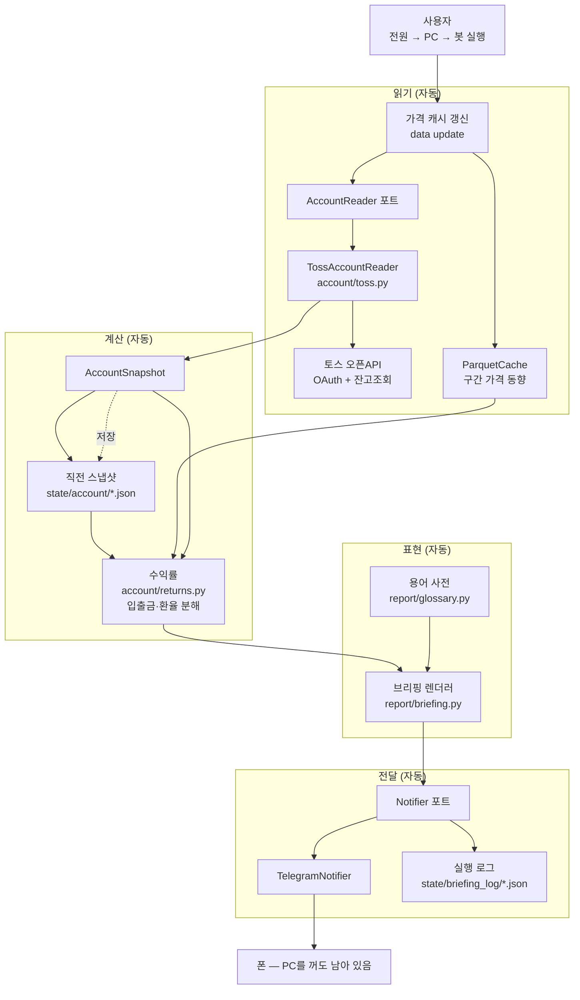

# 주간 브리핑 M1 설계 — 계좌 읽기·쉬운 워딩·모바일 전달

- 날짜: 2026-08-17
- 상태: 초안 — 사용자 승인 대기
- 검토 근거: [`docs/weekly_briefing_design_review.md`](../../weekly_briefing_design_review.md)
- 확정된 방향: **반자동** (제안 → 모바일 승인 → 집행). 이 문서는 그 종착지로 가는
  첫 단계만 설계한다.
- 확정된 실행 환경: **내 로컬 PC.** 전원·PC·봇을 손으로 켜고, 그 뒤부터는 자동.

## 1. 한 문단 요약

주말에 PC를 켜고 봇을 한 번 실행하면, 봇이 토스증권 계좌를 **읽고** 마지막 실행
이후 무슨 일이 있었는지 주식 비전문가의 말로 정리해 텔레그램으로 보낸다. 그 뒤에는
PC를 꺼도 되고, 브리핑은 폰에 남아 밖에서 본다. 주문은 하지 않고 매매 제안도 하지
않는다 — 그 둘은 M3의 몫이고, 검증을 통과한 전략이 생긴 뒤의 일이다. M1이 만드는
것은 **읽기 전용 계좌 포트, 입출금·환율을 반영한 정직한 수익률, 용어를 한 곳에서
강제하는 장치, 단방향 알림 채널, 그리고 이 넷을 더블클릭 한 번으로 굴리는 실행
경로**다. 주문 코드가 한 줄도 없으므로 **M1의 어떤 버그도 돈을 움직이지 못한다.**

## 2. 범위

### 요구사항 5의 변경 — 먼저 명시한다

원래 요구사항 5는 "READ 및 제안은 PC가 켜져있지 않아도 밖에서 모바일로도 즉시 받을
수 있어야 한다"였다. 로컬 PC 실행을 택하면서 **이 요구는 다음으로 바뀌었다.**

> PC를 켜서 봇을 한 번 돌리면, 결과는 폰에 남아 **PC를 끈 뒤에도 밖에서** 볼 수 있다.

"즉시"와 "PC 없이"는 포기하고, "모바일에서 본다"는 유지한다. 상시 가동 호스트를
두지 않기로 한 결정의 직접적인 대가이고, 여기 적어 두는 이유는 나중에 "왜 토요일에
자동으로 안 오지"를 다시 묻지 않기 위해서다.

### 만드는 것

| 요구 | 산출물 |
|---|---|
| 1. 계좌 현황 read | `account/` — 읽기 전용 포트 + 토스 구현 + 수익률 계산 |
| 3. 쉬운 워딩 | `report/glossary.py` + 금칙어 테스트 |
| 5. 모바일 전달 | `notify/` 텔레그램 + `주간 브리핑.bat` 실행 경로 |

### 만들지 않는 것

- **주문·집행 경로 일체.** `broker/`는 건드리지 않는다. 토스 자격증명은 M1에서
  조회에만 쓰인다.
- **매매 제안** (요구사항 4). M3. 근거는 검토 문서 §4.4 — 승격을 통과한 전략이
  없고, 주간 리밸런싱으로는 판정을 낸 적조차 없다.
- **뉴스** (요구사항 2). M2.
- **리눅스 이식.** 로컬 실행으로 확정되면서 필요가 없어졌다 (§5).
- GUI 변경. `gui.py`는 그대로 두고 M1은 CLI 경로만 쓴다.
- 백테스트·모의투자 경로 변경.

### 왜 이 순서인가

M1은 알고리즘의 품질과 무관하게 성립한다. 그리고 M1이 쌓는 계좌 스냅샷이 **M3에서
제안을 실계좌로 검증할 때의 원천 데이터**가 된다. 먼저 돌려둘수록 M3이 빨라진다.

## 3. 전체 흐름



손으로 하는 것은 맨 왼쪽 하나뿐이고, 주문 경로가 이 그림에 없다는 것이 M1의 핵심
성질이다.

## 4. 컴포넌트 설계

### 4.1 `account/` — 읽기 전용 포트

`broker/base.py`의 `Broker`(주문·체결 11개 메서드)와 **별개의 포트**를 신설한다.
계좌를 읽기 위해 주문 인터페이스를 구현해야 하는 현재 구조가 M1을 막는 것이
검토의 결론이었다.

```python
# src/tradingbot/account/base.py

@dataclass(frozen=True)
class Holding:
    symbol: str          # KR은 6자리 코드, US는 티커 (symbols.py 관례와 동일)
    market: str          # "KR" | "US"
    qty: float           # 소수점 매수 대비 float
    qty_display: str     # 토스가 준 표기 그대로 — 화면에는 이것을 쓴다
    avg_price: float     # 증권사가 준 매입단가. 우리가 계산하지 않는다.
    last_price: float
    currency: str        # "KRW" | "USD"

@dataclass(frozen=True)
class AccountSnapshot:
    as_of: datetime               # 증권사가 준 기준 시각
    holdings: tuple[Holding, ...]
    cash: dict[str, float]        # currency -> 예수금
    fx_to_krw: dict[str, float]   # currency -> 원화 환율

class AccountReader(Protocol):
    def snapshot(self) -> AccountSnapshot: ...
```

네 가지 설계 판단:

- **`Portfolio`를 재사용하지 않는다.** `portfolio.py:22`의 `apply_fill`은 체결을
  쌓아 평단을 스스로 만든다. 실계좌는 반대다 — 증권사가 준 수량·평단이 진실이고,
  우리가 계산하면 수수료·분할·배당재투자·앱에서 직접 한 매매 때문에 어긋난다.
- **`as_of`는 증권사가 준 시각**이지 우리 시계가 아니다. 응답이 캐시된 옛 데이터일
  때 조용히 넘어가지 않기 위해서다. 렌더러가 이 값이 6시간 이상 오래되면 브리핑에
  경고를 넣는다.
- **환율을 스냅샷 안에 박아 넣는다.** 나중에 다시 계산해도 같은 숫자가 나와야 한다.
  **해외주식 잔고 응답에 원화 평가액과 적용 환율이 온다(확인됨)**, 그러니 그 값을
  그대로 쓴다. `data/macro.py:32`의 `usdkrw`는 응답에 값이 빠졌을 때의 폴백으로만
  두고, 어느 쪽에서 왔는지 스냅샷에 기록한다 — 내가 계산한 환율과 증권사가 적용한
  환율이 다르면 앱 화면과 브리핑의 숫자가 어긋나기 때문이다.
- **수량은 토스가 준 표기를 그대로 보존한다.** `qty`는 계산용이고 `qty_display`가
  화면용이다. 소수점 보유에서 float 반올림으로 앱과 다른 숫자를 보여주면, 그 순간
  사용자는 브리핑 전체를 의심하게 된다. 요구사항 3은 쉬운 말만이 아니라 **앱과 같은
  숫자**를 요구한다.

#### 토스 구현 (`account/toss.py`)

- 자격증명은 `data/credentials.py`의 `require_env` 패턴을 그대로 쓴다 —
  `TOSS_CLIENT_ID`, `TOSS_CLIENT_SECRET`, `TOSS_ACCOUNT_NO`. hint에는 발급 위치
  (WTS 설정 > Open API)와 **허용 IP 등록**을 함께 적는다.
- **토큰 캐시는 선택이 아니라 필수다.** client 당 유효 토큰이 하나뿐이라 새로
  발급하면 이전 것이 즉시 무효화된다. `state/toss_token.json`에 만료시각과 함께
  저장하고, 만료 60초 전에만 재발급한다.
- **유효기간은 하드코딩하지 않는다.** 2차 자료가 1시간과 24시간으로 엇갈리지만
  그건 알 필요가 없다 — 토큰 응답의 `expires_in`을 그대로 신뢰하면 된다. 상수로
  박아두면 토스가 값을 바꿨을 때 조용히 401을 맞는다.
- **403은 특별 취급한다. 로컬 실행에서는 이게 더 중요해졌다.** 집 공인 IP는 ISP가
  언제든 바꿀 수 있고(§5.2), 바뀌면 키가 맞아도 403이다. 403을 잡아 "허용 IP 목록에
  현재 공인 IP가 있는지 확인하세요"라는 문구와 **현재 공인 IP를 함께** 출력한다.
  그대로 복사해 토스 설정에 붙여넣을 수 있어야 한다.

### 4.2 `account/returns.py` — 정직한 수익률

`report/metrics.py`는 **입출금이 없는 백테스트 전제**로 `equity/initial_cash - 1`을
쓴다. 실계좌에 그대로 쓰면 틀린다. M1은 별도 함수를 둔다.

**종목별 수익률.** 증권사가 준 평단 기준: `(last_price - avg_price) / avg_price`.
USD 종목은 여기에 환율 기여를 분리해 두 줄로 낸다.

```
원화 수익률 ≈ (1 + 주가 수익률) × (1 + 환율 변동) - 1
```

"주가는 올랐는데 원화로는 손해"를 설명하지 못하면 요구사항 3이 무너진다.

**전체 수익률.** 스냅샷을 이어붙인 시간가중수익률(TWR)로 계산한다. 각 구간의
수익률은 그 구간의 입출금을 제외하고 재므로 "이번에 100만원 넣었더니 수익률이
올랐다" 같은 거짓말을 하지 않는다.

**구간이 불규칙하다는 것이 로컬 실행의 핵심 변화다.** 손으로 켜는 이상 정확히 7일
간격이 아니다. 3주 만에 켤 수도 있고 한 주에 두 번 켤 수도 있다. 그래서 M1은
"지난 주"가 아니라 **"마지막 스냅샷 이후"** 구간을 다룬다.

- TWR은 원래 불규칙 구간에 맞는 도구이므로 계산식은 그대로 성립한다. 구간 길이만
  달라진다.
- 브리핑은 **"마지막 브리핑 이후 N일"**을 항상 첫 줄 근처에 밝힌다. 같은 "+1.2%"라도
  8일치인지 23일치인지에 따라 뜻이 완전히 다르다.
- 간격이 길면(기본 14일 초과) "그 사이 시장에서 일어난 일 중 이 브리핑이 담지 못한
  것이 있습니다"를 덧붙인다.

**입출금을 어떻게 아는가.** 토스 API에 입출금 내역 조회가 있으면 그대로 쓴다.
없다면 스냅샷 두 개만으로는 입금과 수익을 구분할 수 없다. **어느 쪽인지 몰라도
착수할 수 있다** — 아래 폴백이 두 경우를 모두 덮고, 실제 응답을 보면서 결정하면
된다.

> 설명되지 않는 평가액 변화가 임계치(기본 1%)를 넘으면 **그 구간의 전체 수익률을
> 계산하지 않고 "측정 불가"로 표시**하고, 입출금이 있었는지 되묻는 문장을 브리핑에
> 넣는다.

이건 이 저장소가 이미 쓰는 규칙이다 — `research/evaluation.py:269`가 구간이 부족한
walk-forward 승률을 통과가 아니라 "측정 불가"로 남기는 것과 같은 원칙이다. **틀린
숫자보다 빈칸이 낫다.**

### 4.3 스냅샷 저장 — `state/account/`

`state/account/YYYYMMDDTHHMMSS.json`에 스냅샷 원본을 그대로 남긴다.

- **주차(`YYYY-Www`)를 키로 쓰지 않는다.** 실행 시점이 불규칙해서 한 주에 두 개가
  생기거나 몇 주가 비는데, 주차 키는 그 경우 덮어쓰거나 구멍을 만든다. 타임스탬프는
  실제로 일어난 일을 그대로 기록한다.
- **PIT 패널(`data/panel.py`)에 넣지 않는다.** 패널에 들어가면 팩터 입력으로
  오해되어 백테스트에 샐 수 있다. 계좌 잔고는 연구 데이터가 아니다.
- 이 파일들이 TWR 체인의 원천이고, M3에서 제안을 실계좌 결과와 대조할 때의 기록이
  된다. **PC 로컬에만 있으므로 백업 대상이다** (§5.3).

### 4.4 `report/glossary.py` — 워딩을 한 곳에서 강제

요구사항 3은 "이 세션에서 개발 후 보고, 알림 등에서도 유효"를 요구한다. 출력 경로가
늘 때마다 워딩이 각자 갈라지는 것을 막는 방법은 하나뿐이다 — **사전을 한 곳에 두고,
테스트로 강제한다.**

```python
@dataclass(frozen=True)
class Term:
    label: str        # 화면에 나가는 쉬운 이름
    one_line: str     # 한 줄 설명
    fmt: Callable[[float], str]

TERMS: dict[str, Term] = {
    "total_return":  Term("전체 수익률", "처음 넣은 돈 대비 지금 얼마나 늘었는지", pct),
    "max_drawdown":  Term("최대 하락폭", "가장 좋았던 때보다 얼마나 떨어졌었는지", pct),
    ...
}

BANNED = ("Sharpe", "샤프", "MDD", "drawdown", "exposure", "profit factor", ...)
```

**테스트가 이 설계의 핵심이다.** 사용자에게 나가는 문자열에 `BANNED` 항목이 그대로
등장하면 실패한다. "설명을 붙이면 허용" 같은 예외를 두는 순간 테스트가 무의미해지니,
M1은 전면 금지로 간다. 필요한 개념에는 새 이름을 준다.

`report/report.py:57`의 "Equity Curve"·"Drawdown"·"DD %"는 백테스트 리포트라 M1
범위 밖이지만, 사전이 생기면 나중에 같은 곳을 바라보게 만들 수 있다.

### 4.5 `report/briefing.py` — 브리핑 렌더러

입력은 이번 스냅샷 + 직전 스냅샷 + 가격 캐시. 출력은 텔레그램용 텍스트.

**섹션 목록으로 짠다.** M2의 뉴스와 M3의 제안이 섹션 하나씩 추가되는 형태로 붙어야
하기 때문이다.

```
① 한 줄 요약      "지난 12일 동안 전체 자산은 1.2% 늘었습니다."
② 이번 구간 전체  기간(N일), 평가액, 구간 변화, 누적 수익률(또는 측정 불가 사유), 현금 비중
③ 종목별          이름 · 보유 · 평단 · 현재가 · 수익률(USD 종목은 주가/환율 분해)
④ 구간 가격 동향  종목별 해당 구간의 변화
⑤ 알아둘 점       환율 영향, 레버리지 ETF 주석, 데이터 문제, 오래된 스냅샷·긴 공백 경고
```

**기간을 ①과 ②에 모두 쓴다.** 로컬 실행에서는 이게 숫자만큼 중요한 정보다.

**레버리지 ETF 주석은 M1부터 넣는다.** SOXL·TECL을 보유 중이면 "3배 ETF는 하루
단위로 3배라서, 여러 날을 합치면 기초지수의 정확히 3배가 아닙니다" 한 줄을 붙인다.
검토 문서 §4.2가 지적한 대로 이건 M2(뉴스)의 문제가 아니라 **워딩 설계의 문제**이고,
보유 중이라면 M1에서 이미 오해가 시작된다. 실행 간격이 길수록 이 괴리가 커지므로
로컬 실행에서 더 중요해졌다.

텔레그램 메시지 상한(4096자)을 넘으면 섹션 경계에서 나눈다.

### 4.6 `notify/` — 단방향 알림

```python
class Notifier(Protocol):
    def send(self, text: str) -> None: ...
```

`notify/telegram.py`가 Bot API `sendMessage`로 구현한다. `TELEGRAM_BOT_TOKEN`,
`TELEGRAM_CHAT_ID`를 환경변수로 받는다.

**왜 로컬 실행인데도 텔레그램인가.** 콘솔이나 HTML 리포트로 끝내면 그 결과는 PC
안에 남고, PC를 끄면 사라진다. 텔레그램으로 보내면 **PC를 끈 뒤에도 폰에 남아
밖에서 볼 수 있다** — 요구사항 5에서 살아남은 부분이 정확히 이것이다.

M1의 Notifier는 단방향이다. 전송 실패는 3회 재시도(2s/4s/8s) 후 로컬 로그에 남기고
**종료코드 1**로 끝낸다. 조용히 성공한 척하지 않는다.

> **M3 승인이 로컬 실행에서 훨씬 쉬워졌다.** 상시 호스트에서 주 1회 깨어나는
> 구조였다면 사용자가 승인 버튼을 누르는 시점에 프로세스가 죽어 있어서, 대기 상태
> 파일과 webhook 수신기를 따로 만들어야 했다. 로컬에서는 사용자가 PC 앞에 있는
> 동안 봇이 살아 있으므로 **같은 실행 안에서 텔레그램 콜백을 폴링해 승인을 받고
> 집행까지 끝낼 수 있다.** M3 설계는 이 이점에서 출발한다.

### 4.7 CLI와 실행 시점

```
tradingbot briefing weekly [--dry-run] [--no-notify] [--skip-update]
```

`cli.py`의 기존 서브파서 패턴(`set_defaults(handler=...)`)을 그대로 따른다.

- `--dry-run`: 계좌를 읽고 렌더까지만, 전송하지 않는다. 셋업 검증용.
- `--skip-update`: 가격 캐시 갱신을 건너뛴다. 기본은 **갱신함** — 몇 주 만에 켰을
  때 옛날 가격으로 동향을 그리는 것을 막기 위해서다.

실행 로그는 `state/briefing_log/YYYYMMDDTHHMMSS.json`. `data/pipeline.py:250`의
`PipelineResult.to_dict()` 패턴을 그대로 재사용한다.

**실행 시점은 사용자가 정하되, 봇이 판단해 알려준다.** 고정 시각이 없으므로 대신
브리핑이 스스로 조건을 확인한다.

- 미국 금요일 장은 한국 시간 토요일 새벽(EDT 05:00 / EST 06:00 KST)에 닫힌다.
  **토요일 아침 이후에 켜는 것을 권장**하고, 그 전에 켜면 "미국 시장의 이번 주가
  아직 닫히지 않았습니다"를 브리핑에 넣는다. 실행을 막지는 않는다 — 사용자가 알고
  보는 것과 모르고 보는 것의 차이만 만든다.

M3의 매매 제안은 개장 전에 나와야 의미가 있으므로 실행 조건이 다르다. 그래서 M1의
브리핑과 M3의 제안은 **처음부터 별개 서브커맨드**로 둔다.

## 5. 실행 환경 — 로컬 Windows PC

상시 가동 호스트(VPS·라즈베리파이·클라우드)를 두지 않기로 확정했다. 실행은 내가
쓰던 PC에서 하고, 전원·PC·봇을 손으로 켠 뒤부터는 전부 자동이다.

**이 결정으로 없어진 작업이 있다.** 이전 판에서 "M1의 첫 작업"으로 잡았던
`pyproject.toml:39`의 `[tool.uv] environments = ["sys_platform == 'win32'"]` 수정은
**필요 없다.** 리눅스로 옮기지 않으므로 락파일은 그대로 두면 되고, `truststore`
기반 인증서 경로와 `data/cache/` 로컬 디스크 전제도 이미 동작하는 그대로다. M1에서
건드릴 실행 환경 작업은 아래 셋뿐이다.

### 5.1 실행 경로 — `.bat` 더블클릭

저장소에 이미 `트레이딩봇 실행.bat`과 `데이터 수집.bat` 관례가 있다. 같은 형태로
**`주간 브리핑.bat`** 하나를 추가한다. `.venv`가 없으면 `uv sync`까지 하고,
`briefing weekly`를 실행한 뒤, **결과를 창에 남긴 채 대기**한다(성공했든 실패했든
사용자가 읽을 수 있어야 한다).

작업 스케줄러 등록은 **선택**이다. PC가 켜져 있는 토요일 아침이면 자동 실행되도록
걸어둘 수 있지만, PC가 꺼져 있으면 그냥 지나간다. 기본 운영 방식은 더블클릭이다.

### 5.2 허용 IP — 집 공인 IP를 등록한다

토스가 호출 IP를 허용 목록으로 검사하므로, **집 인터넷의 공인 IP를 등록**한다.
국내 가정용 회선은 대체로 오래 유지되지만 고정을 보장하지 않는다. ISP가 바꾸면
**403이 뜨고 브리핑이 실패한다.**

- 이건 조용한 실패가 아니다 — 손으로 켠 직후 창에 바로 보인다. 로컬 실행이라
  오히려 감지가 쉽다.
- §4.1대로 403 메시지에 **현재 공인 IP를 함께 출력**해서, 토스 설정에 그대로
  복사해 넣고 다시 실행하면 끝나게 한다.
- 재등록 절차는 README에 세 줄로 적어 둔다. 몇 달에 한 번 겪을 일이라 그때는 잊고
  있을 것이다.

### 5.3 백업 — 이제 내 책임이다

`state/account/` 스냅샷은 TWR 체인의 유일한 원천이고(§4.3), 이제 **내 PC 디스크에만
있다.** 디스크가 죽으면 수익률 이력이 사라진다.

- 스냅샷은 텍스트 JSON이라 작다. `state/account/`를 클라우드 드라이브 동기화
  폴더에 두거나, 브리핑 실행 시 별도 폴더로 복사하는 것으로 충분하다.
- **저장소에 커밋하지는 않는다** — 계좌 잔고가 git 이력에 남는다.
- 가격 캐시(`data/cache/`)는 다시 받으면 되므로 백업 대상이 아니다.

## 6. 보안

로컬 실행으로 **보안 요구가 크게 가벼워졌다.** 자격증명이 내 PC 밖으로 나가지 않고,
남이 접근할 수 있는 상시 호스트도 없다.

- 자격증명은 환경변수로만 전달한다. 저장소에 커밋하지 않는다.
- `.env.template`에 `TOSS_*`, `TELEGRAM_*` 항목을 추가하되 값은 비운다.
- `state/toss_token.json`이 `.gitignore`의 `state/` 규칙에 덮이는지 확인한다.
- **읽기 전용 스코프가 있으면 그것으로 발급한다.** 없어도 M1에는 주문 코드가
  없으므로 우리 코드가 주문을 내지 못한다는 보장은 그대로다.

## 7. 실패 모드

| 실패 | 감지 | 처리 |
|---|---|---|
| 허용 IP 불일치 | HTTP 403 | "허용 IP 확인" + **현재 공인 IP** 출력, 종료코드 1 |
| 토큰이 다른 곳에서 무효화됨 | HTTP 401 | 1회 재발급 후 재시도, 실패 시 보고 |
| 토스 API 장애 | 5xx / 타임아웃 | 3회 지수 백오프. 실패해도 **직전 스냅샷 기준 브리핑을 보내고** 그 사실을 명시 |
| 텔레그램 전송 실패 | HTTP 오류 | 3회 재시도 → 로컬 로그 + 종료코드 1. **콘솔에는 브리핑 전문을 그대로 출력**해서 최소한 화면으로는 읽게 한다 |
| 가격 캐시가 오래됨 | 실행 시 자동 갱신 + 기존 staleness 가드 | 갱신 실패 시 동향 섹션에 "가격이 N일 오래됨" 표기 |
| 입출금 미상 | 설명 안 되는 평가액 변화 | 그 구간 전체 수익률을 "측정 불가"로 (§4.2) |
| 마지막 실행 이후 오래됨 | 직전 스냅샷 타임스탬프 | 기간을 명시하고, 14일 초과면 공백 경고 (§4.2) |

**하트비트는 두지 않는다.** 상시 호스트 안이었다면 "정상이든 아니든 매주 한 통"이
죽은 시스템을 감지하는 유일한 수단이었지만, 로컬 실행에서는 **브리핑이 안 오는 것은
내가 안 켰다는 뜻**이라 감지할 대상이 없다. 대신 그 자리를 **"마지막 브리핑 이후
N일"** 표기가 대신한다 — 켜는 것을 잊었다는 사실은 다음에 켰을 때 숫자로 보인다.

## 8. M2·M3이 붙는 자리

| 단계 | 붙는 곳 | M1에서 미리 해둘 것 |
|---|---|---|
| M2 뉴스 | `report/briefing.py`에 섹션 추가 | 렌더러를 섹션 목록으로 (§4.5) |
| M3 제안 | `generate_targets` + `plan_rebalance` → 제안 섹션 | 스냅샷의 현재 비중이 `plan_rebalance`의 `current_weights` 입력이 되도록 형태를 맞춰 둔다 |
| M3 승인 | 같은 실행 안에서 텔레그램 콜백 폴링 | 로컬 실행 덕에 별도 수신기가 필요 없다 (§4.6) |
| M3 집행 | `broker/toss.py` 신설 | `account/toss.py`의 인증·토큰 캐시를 공유 모듈로 분리해 둔다 |

**M1에서 하지 말아야 할 것:** M3을 위해 지금 추상화를 미리 만들지 않는다. 위 표는
"나중에 어디를 건드릴지"의 지도이지 지금 만들 인터페이스 목록이 아니다.

## 9. 완료 기준

1. `주간 브리핑.bat` 더블클릭 → 계좌를 읽고 브리핑을 렌더해 텔레그램으로 보낸다.
2. 폰에서 그 메시지를 받고, **PC를 끈 뒤에도** 읽을 수 있다.
3. 시점을 달리해 두 번 실행하면 `state/account/`에 스냅샷 2개가 쌓이고, 두 번째
   브리핑이 **구간 일수와 함께** 수익률(또는 "측정 불가" 사유)을 보여준다.
4. USD 종목 보유 시 주가 기여와 환율 기여가 분리되어 표시된다.
5. 금칙어 테스트가 존재하고 통과한다 — 브리핑 출력에 `BANNED` 용어가 없다.
6. 403(허용 IP 불일치)과 401(토큰 무효)이 서로 다른 메시지로 보고되고, 403에는
   현재 공인 IP가 함께 나온다. 실패를 주입한 테스트로 검증한다.
7. 텔레그램 전송이 실패해도 브리핑 전문이 콘솔에 남는다.
8. 기존 `pytest`가 전부 통과한다.
9. 주문 관련 코드가 M1 diff에 없다.

## 10. 확인 결과와 남은 질문

### 확정된 것

| 항목 | 결과 | 반영 |
|---|---|---|
| 해외주식 잔고의 원화 평가액·환율 | **온다** | §4.1 — 응답 값을 쓰고 `usdkrw`는 폴백 |
| 소수점 보유 수량 표기 | **토스 표시와 동일하게** | §4.1 — `qty_display` 원본 보존 |
| 토큰 유효기간 | 상수로 박지 않음 | §4.1 — 응답의 `expires_in`을 신뢰 |
| 에이전트 클라우드 실행 | **불가 (실측)** — 토스·텔레그램 호스트가 egress에서 차단, 고정 IP 없음, 컨테이너 휘발성 | §5 (로컬로 확정) |
| 실행 위치 | **로컬 Windows PC, 수동 실행** | §5 |

### 착수를 막지 않는 것

`developers.tossinvest.com`이 이 세션의 조직 egress 정책으로 차단되어(403) 공식
스펙을 직접 읽지 못했다. 그러나 남은 두 질문은 **M1 착수를 막지 않는다.**

1. **입출금 내역 조회 API가 있는가.** §4.2가 있는 경우와 없는 경우를 모두 덮도록
   설계되어 있다. 실제 응답을 보면서 결정한다.
2. **읽기 전용 스코프가 있는가.** M1에는 주문 코드가 없으므로 **우리 코드가 주문을
   내지 못한다는 보장은 스코프와 무관하게 성립한다.** 로컬 실행이라 키가 남의 서버에
   놓이지도 않는다. 다만 읽기 전용이 있다면 그것으로 발급한다.

두 질문 모두 **첫 API 호출을 해보는 순간 답이 나온다.**

### 여전히 확인하면 좋은 것

3. 허용 IP를 몇 개까지 등록할 수 있는가 — 하나뿐이어도 로컬 실행에서는 문제가 없다
   (개발과 운영이 같은 PC, 같은 IP다). 여러 개 등록할 수 있다면 회사·모바일 핫스팟
   등에서도 돌릴 수 있으니 알아두면 편하다.
